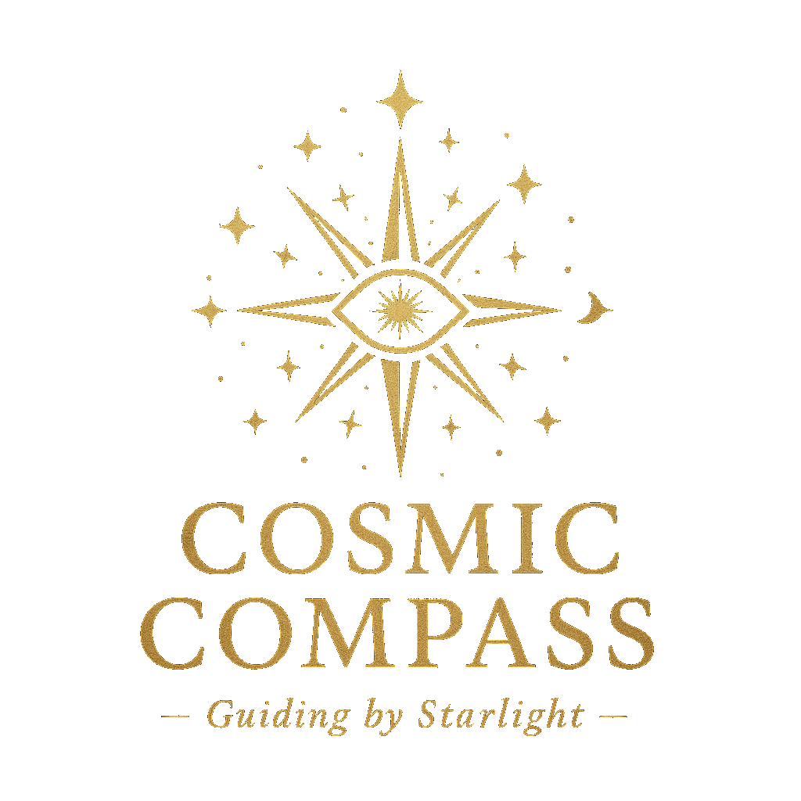

# 🌟 Cosmic Compass - Daily Horoscope App



**Cosmic Compass** is a modern, feature-rich horoscope application that provides personalized astrological insights for all 12 zodiac signs. Built with React, TypeScript, and powered by AI-driven horoscope predictions.

## ✨ Features

### 🔮 Core Horoscope Features
- **Daily Horoscopes** - Get personalized daily predictions
- **Weekly Horoscopes** - Weekly cosmic insights and guidance  
- **Monthly Horoscopes** - Long-term astrological forecasts
- **All 12 Zodiac Signs** - Complete coverage from Aries to Pisces
- **Date Selection** - View horoscopes for past, present, and future dates (±5 days from today)
- **Smart Caching** - Efficient horoscope data caching for better performance

### 🌍 Internationalization
- **7 Language Support**:
  - 🇺🇸 English
  - 🇪🇸 Spanish (Español)
  - 🇫🇷 French (Français)
  - 🇨🇳 Chinese (中文)
  - 🇯🇵 Japanese (日本語)
  - 🇩🇪 German (Deutsch)
  - 🇷🇺 Russian (Русский)
- **Real-time Translation** - Horoscopes automatically translated using AI
- **Localized UI** - Welcome messages and interface elements in multiple languages

### 🎧 Accessibility Features
- **Text-to-Speech** - Listen to your horoscope in your selected language
- **Responsive Design** - Perfect experience on desktop, tablet, and mobile
- **Keyboard Navigation** - Full keyboard accessibility support
- **Screen Reader Friendly** - Proper ARIA labels and semantic HTML

### 🎨 User Experience
- **Modern UI Design** - Beautiful glassmorphism effects and animations
- **Cosmic Theme** - Stunning starry background with space imagery
- **Smooth Animations** - Elegant transitions and hover effects
- **Loading States** - "Consulting the cosmos..." loading animations
- **Error Handling** - Graceful error messages with cosmic terminology
- **Interactive Elements** - Hover effects and visual feedback

### 📱 Technical Features
- **Progressive Web App** - Fast loading and offline-capable
- **TypeScript** - Type-safe development for reliability
- **Responsive Grid** - Adaptive layout for all screen sizes
- **API Integration** - Real-time horoscope data from external API
- **Proxy Server** - Secure API handling through Express.js backend
- **Build Optimization** - Vite-powered fast builds and hot reloading

## 🏗️ Architecture

### Frontend Stack
- **React 19** - Modern React with latest features
- **TypeScript** - Type-safe JavaScript
- **Vite** - Lightning-fast build tool
- **Tailwind CSS** - Utility-first CSS framework
- **React Hooks** - Custom hooks for text-to-speech and state management

### Backend
- **Express.js** - Node.js server for API proxying
- **HTTP Proxy Middleware** - Secure API request handling
- **Static File Serving** - Optimized asset delivery

### External Services
- **Horoscope API** - Real-time astrological data
- **Translation Service** - Multi-language support
- **Web Speech API** - Text-to-speech functionality

## 🎯 Zodiac Signs Supported

| Sign | Date Range | Symbol |
|------|------------|---------|
| ♈ Aries | Mar 21 - Apr 19 | Ram |
| ♉ Taurus | Apr 20 - May 20 | Bull |
| ♊ Gemini | May 21 - Jun 20 | Twins |
| ♋ Cancer | Jun 21 - Jul 22 | Crab |
| ♌ Leo | Jul 23 - Aug 22 | Lion |
| ♍ Virgo | Aug 23 - Sep 22 | Virgin |
| ♎ Libra | Sep 23 - Oct 22 | Scales |
| ♏ Scorpio | Oct 23 - Nov 21 | Scorpion |
| ♐ Sagittarius | Nov 22 - Dec 21 | Archer |
| ♑ Capricorn | Dec 22 - Jan 19 | Goat |
| ♒ Aquarius | Jan 20 - Feb 18 | Water Bearer |
| ♓ Pisces | Feb 19 - Mar 20 | Fish |

## 🚀 Getting Started

### Prerequisites
- **Node.js** (v16 or higher)
- **npm** or **yarn**

### Installation

1. **Clone the repository**
   ```bash
   git clone <repository-url>
   cd Cosmic-Compass
   ```

2. **Install dependencies**
   ```bash
   npm install
   ```

3. **Set up environment variables**
   - Create a `.env.local` file
   - Add your Gemini API key:
     ```
     GEMINI_API_KEY=your_api_key_here
     ```

4. **Run the development server**
   ```bash
   npm run dev
   ```
   The app will be available at `http://localhost:5173`

### Production Deployment

1. **Build the application**
   ```bash
   npm run build
   ```

2. **Start the production server**
   ```bash
   npm start
   ```
   The app will run on port 8080 (or your specified PORT environment variable)

## 📝 Usage

1. **Select Language** - Choose your preferred language from the dropdown
2. **Pick a Date** - Use the date selector to choose when you want your horoscope for
3. **Choose Your Sign** - Click on your zodiac sign from the beautiful grid
4. **Explore Periods** - Switch between Daily, Weekly, and Monthly predictions
5. **Listen** - Use the text-to-speech feature to hear your horoscope
6. **Navigate** - Use the back button to return to sign selection

## 🛠️ Development Scripts

```bash
# Development server with hot reloading
npm run dev

# Build for production
npm run build

# Preview production build
npm run preview

# Start production server
npm start
```

## 🎨 Customization

The app uses Tailwind CSS for styling, making it easy to customize:

- **Colors**: Modify the cosmic theme colors in `tailwind.config.js`
- **Fonts**: Update typography in the CSS files
- **Animations**: Customize transitions and effects
- **Languages**: Add new languages in `components/LanguageSelector.tsx`

## 🌟 Contributing

We welcome contributions! Whether it's:
- Adding new languages
- Improving the UI/UX
- Adding new features
- Bug fixes
- Performance optimizations

## 📜 License

This project is created for Sara H. G. 2025.

---

*Let the stars guide your path with Cosmic Compass* ✨
